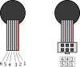

.. index:: ie2-1024, encoder

***********************
IE2-1024 Encoder Family
***********************

.. index:: introduction

Introduction
============

The `IE2-1024`_ is an incremental, two-channel magnetic encoder family with 64
to 1024 lines per revolution. Requires a 5 V supply voltage and outputs two
digital square waves that can be used for the indication and control of both
shaft velocity and direction of rotation as well as for positioning.

.. index:: wiring

Wiring
======

These encoders have 6 wires with the following functions:

===  ===========
Pin  Function
===  ===========
1    Motor -
2    Motor +
3    GND
4    V\ :sub:`dd`
5    Channel B
6    Channel A
===  ===========

   IE2 encoder wire functions.

.. note:: The connector may vary so, when in doubt, simply note that the wires
   are numbered from 1 to 6 starting from right to left, or better, starting
   from the wire that is partially colored in red.

References
==========

.. target-notes::

.. _`IE2-1024`:
   https://www.faulhaber.com/fileadmin/Import/Media/EN_IE2-1024_DFF.pdf
