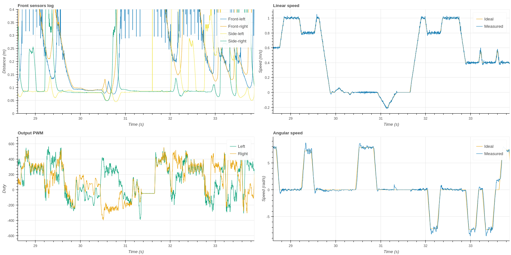

.. index:: logging, bluetooth

*******
Logging
*******

Being able to log the data is very important. Not only it can help us debug and
understand our robot's behavior, but it will also allow us to fine-tune our
control system and make our robot go faster.

How?
====

There are different alternatives to log the data. Most people use on-board
memory storage, be it the microcontroller's own memory, an external EEPROM or
even an SD card.

There are some advantages when using and external memory:

- We can log much more data than if we used only our microcontroller's
  memory
- Storage is very close to the microcontroller, so saving can be pretty fast

There are some disadvantages too, though:

- We do have a limit in the amount of data that we can log
- Read-write code may be a bit cumbersome and boring to implement
- We cannot get our data immediately

Alternatively, we can use a wireless-transmission device to log the data to a
remote computer. This has some advantages:

- We have virtually unlimited log storage
- We can get our data immediately
- Wireless is cool

And disadvantages too:

- May be slower than on-board memory saving
- Drains more power
- Many competitions still disallow using wireless devices, so we will not be
  able to log data during those

Wireless logging
================

Most probably, we will spend most of our time not competing, but training, so
losing the competition data logs may represent a small loss.

However, speed matters and being able to log enough data and fast enough is
important. The question is whether or not a wireless device can provide us with
sufficient speed to log everything we want.

Nowadays we can find very small SMD PCB modules (like the 10x12 mm Air602 WiFi
module) that cost about $2 and allow us to send data at 50 Mbps through SPI.
That is a lot, but the module will also drain some current (110 mA).

While Bluetooth modules are a bit less current-hungry (20-40 mA), they can
communicate at high speeds too through UART and SPI.

Among all the available Bluetooth modules, the :ref:`HC-05` is very common and
provides high speed UART communication at 1 Mbps and up to 3.5+ Mbps. Those
modules are also easily configurable through AT-commands, without needing to
re-flash their firmware using proprietary tools/software.

Fast-sending data
=================

In order to be able to log data in real-time (perhaps each millisecond), using
DMA is mandatory to avoid intervention from the CPU while data is being
transmitted. Once configured, it works like magic. Using the :ref:`HC-05`
module with UART communication at ~1 Mbps with DMA we will be able to comfortly
log 50-70 bytes per millisecond.

Serialization is another important factor. The easiest way is to simply send a
CSV-formatted string. This also eases the process of splitting and processing
the logged frames. It is, however, not the most efficient method and limits the
number of total variables we can log each millisecond.

Another alternative is to send the raw data, in bytes, using some kind of
protocol to be able to differentiate the frames when processing them on the
other end. If your memory allows for it, you may consider using some
well-established protocol such as MessagePack.

Logging more variables
======================

Even if the throughput is limited, we can always sacrifize frequency for size.
Just before writing into the DMA buffer with the new data, we should check
whether the old data has been fully transmitted or not:

- If it has not, we do nothing (wait for the next period)
- If it has, we can write the new data and let the DMA start sending it

This way our robot will always be able to log any number of variables,
adjusting the frequency they are logged at to the maximum possible.

Experimental results
====================

Using:

- A Bluetooth module
- DMA-enabled UART communication with the module, at ~1 Mbps
- CSV-formatted strings

We can comfortably log 10 variables each millisencond with enough precission:

   Real-time logging over Bluetooth results

I want more!
============

If you really need to log a lot of variables, you might be able to:

- Sacrifize that 1-millisecond frequency (sending, for example, twice as much
  variables in 2 milliseconds instead)
- Increase the communication speed of your peripheral (the :ref:`HC-05` already
  allows up to >3 Mbps)
- Use a more efficient serialization protocol
