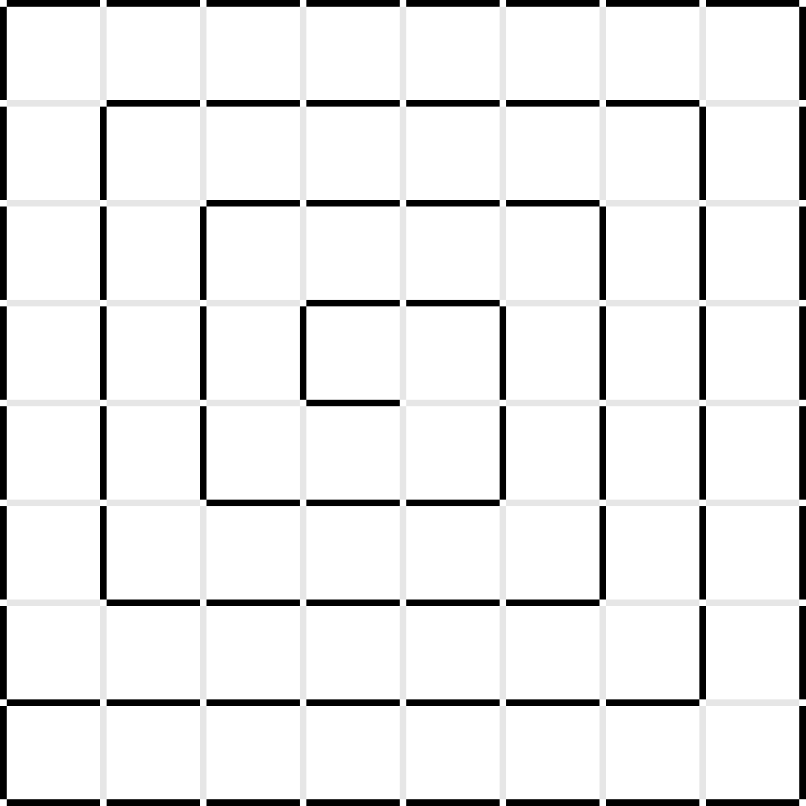

.. index:: micromouse, maze, building

************************
Micromouse maze building
************************

.. index:: introduction

Introduction
============

According to the international micromouse competition rules:

- The maze is composed of 18 x 18 cm unit squares.
- The maze is 16 x 16 unit squares.
- Walls are 5 cm high and 1.2 cm thick.
- The outside wall encloses the entire maze.
- The sides of the maze walls are white, the tops of the walls are red, and the
  floor is black. The maze is made of wood, finished with non-gloss paint.

.. warning:: Do not assume the walls are consistently white, or that the tops
   of the walls are consistently red, or that the floor is consistently black.
   Fading may occur; parts from different mazes may be used. Do not assume the
   floor provides a given amount of friction. It is simply painted plywood and
   may be quite slick. The maze floor may be constructed using multiple sheets
   of plywood. Therefore there may be a seam between the two sheets on which
   any low-hanging parts of a mouse may snag A tolerance of 5% is assumed for
   sizes.

A 16 x 16 maze is probably too big to build one at home for training, so we
probably want to build a reduced version instead.

.. index:: walls

Requirements
============

Worst case scenario is when there is only one way to get from one point to
another in the maze (i.e.: no loops) and the maze ending is just a 1x1 square
(while training we may not need to always have a 2x2 ending).

   An example of a dense 8x8 micromouse maze.

Note that:

- All squares in the maze have 2 walls around except for two of them (i.e.:
  starting and ending points), which have 3.
- All internal walls are actually shared between two squares.

Supposing our maze width is :math:`w` and height is :math:`h`, the maximum
required number of walls would be:

.. math:: n_{walls} = w h + w + h + 1

Taking this into account, and of course, our available space, we can decide on
our training maze size.

.. note:: We may want to reduce the total number of walls by using long
   single-pieced walls for the external walls. We will not need to make `2 *
   (w + h)` extra small walls, but we will not really save that much material
   and will make those walls not interchangeable.

.. index:: constraints

Of course, we must also take into account that, for a :math:`w` by :math:`h`
maze, we will need to make pillars for the walls:

.. math:: n_{pillars} = w h + w + h + 1

Note the number of pillars is exactly the same number as the maximum number of
walls required, although this number is always fixed, no matter the maze
configuration.

We also need to take into account the space required for the base to make sure it fits somewhere at home!

.. math::

   x_{mm} = w * 180 + 12

   y_{mm} = h * 180 + 12

As an example, here is a table with different maze sizes and their associated
requirements:

.. csv-table:: Maze build requirements
   :header: Size, Maximum walls, Pillars, Width (mm), Height (mm)
   :stub-columns: 1

   3x5,24,24,552,912
   4x4,25,25,732,732
   4x6,35,35,732,1092
   6x6,49,49,1092,1092
   8x8,81,81,1452,1452
   16x16,289,289,2892,2892

.. index:: walls

Walls
=====

There are different ways to make the walls. It depends very much on which tools
we have available and our budget as well. The method described here only
requires to have acces to a saw and white glue. Walls will be made with 4 mm
MDF wood, which is cheap (found a 2.44 x 1.22 m sheet at a nearby warehouse for
about 5€).

To make the walls we will glue three parts together, like in a sandwitch:

- Two 167 x 50 mm pieces outside, represented in blue.
- One 172 x 30 mm piece inside (with optionally rounded corners), represented
  in green.

   Maze wall design.

We will be making a 4x6 maze, so we will cut the 2.44 x 1.22 m sheet this way:

- Ten 1220 x 50 mm rectangles.
- Five 1220 x 30 mm rectangles.

Then:

- We cut the 50 mm rectangles in 7 pieces of 167 x 50 mm. Take into account the
  saw width before making the cut. We use 167 instead of 168 to have a small
  marging when placing the walls in the maze.
- We cut the 30 mm rectangles in 7 pieces of 172 x 30 mm. Here again, take into
  account the saw width to try to make the cuts are fine as possible.

.. index:: base

Base
====

The base can be a single-pieced 12 mm wood, in which we need to make
through-holes for the pillars' wooden dowels. Dimensions are according to our
maze size, of course.

For our 4 x 6 maze we will cut a 860 x 1220 mm rectangle.

.. note:: MDF wood is ideal for the base too (cheap and nice surface finish).

.. index:: pillars

Pillars
=======

For the pillars we will use 3D-printed plastic. The 3D design can be defined
using `CadQuery <https://github.com/dcowden/cadquery>`_:

.. literalinclude:: ../../3d/pillar.py

   Maze pillar design.

We will also require 6 x 30 mm wooden dowels for each pillar. The dowels can be
inserted in the pillar with a hammer.

.. note:: Instead of making 30 mm grooves we may want to make them complete
   along the pillar (i.e.: 50 mm). In that case the pillar would simply become
   a bit weaker on the base and could more easily break.
